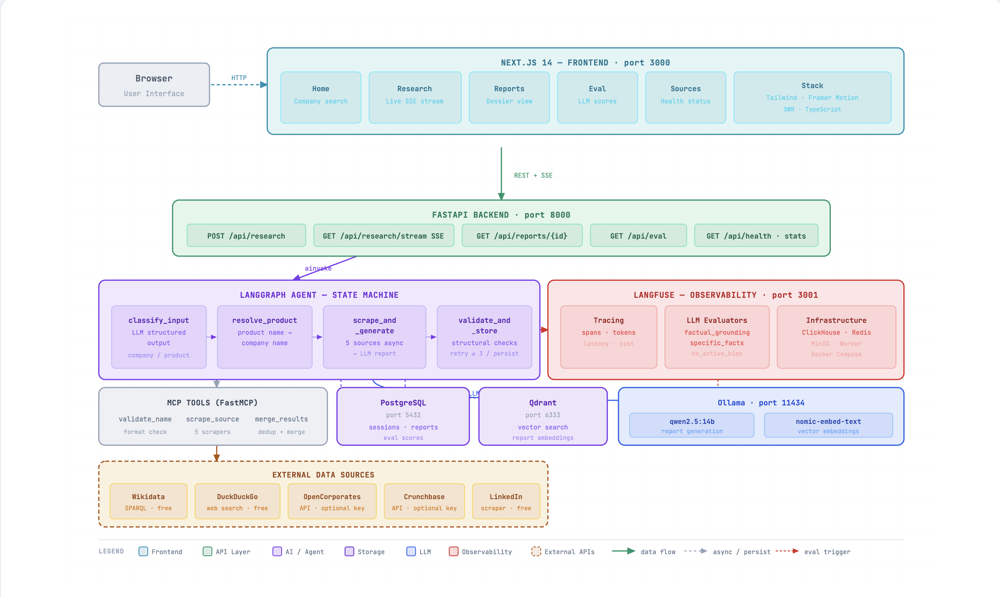

# Scout — Company Intelligence Agent

An agentic AI pipeline that accepts a company or product name, scrapes validated public sources in parallel, generates a structured research report via a local LLM, evaluates output quality with LLM-as-judge, and stores results in PostgreSQL + Qdrant — all running fully locally with no external API keys required.

---

## Architecture



> For the full interactive version, open [`architecture.html`](architecture.html) in a browser.

**Stack at a glance:**

| Layer | Technology |
|-------|-----------|
| Frontend | Next.js 14 (App Router) · Tailwind CSS · Framer Motion · SWR |
| Backend | FastAPI · uvicorn · SSE (real-time progress streaming) |
| Agent | LangGraph state machine (5 nodes) |
| LLM | Ollama — `qwen2.5:14b` (generation) · `nomic-embed-text` (embeddings) |
| Tools | FastMCP — 5 scrapers exposed as MCP tools |
| Storage | PostgreSQL (asyncpg) · Qdrant (vector search) |
| Observability | Langfuse v3 — tracing, spans, LLM-as-judge evaluators |
| Infrastructure | Docker Compose (PostgreSQL · Qdrant · Langfuse · ClickHouse · Redis · MinIO) |

---

## Agent Pipeline

```
classify_input
    ├── invalid  → emit_error → END
    ├── product  → resolve_product ──┐
    └── company  ────────────────────┤
                                     ↓
                           scrape_and_generate
                           (5 sources in parallel)
                                     ↓
                           validate_and_store
                               ├── passed → END
                               ├── retry (≤ 3) → scrape_and_generate
                               └── max retries → store best → END
```

**Scrapers (all run concurrently via `asyncio.gather`):**
- **Wikidata** — SPARQL: founders (P112), CEO (P169), HQ, revenue, website
- **DuckDuckGo** — 3 targeted searches: financial data, contact info, general overview
- **OpenCorporates** — legal registration, jurisdiction, incorporation date
- **Crunchbase** — funding rounds, investors, valuation (optional API key)
- **LinkedIn** — employee count, company overview (stealth scraper)

**Validation (structural, deterministic):**
- All 6 required sections present
- Minimum 500 characters
- Financials section contains real data (not placeholders)
- Contact section contains real data

**LLM-as-judge (async, via Langfuse evaluators):**
- `eval/factual_grounding` — detects hallucinated figures or contacts
- `eval/specific_facts` — checks report contains concrete verifiable data
- `eval/no_active_bias` — verifies historical founders not shown as currently active

---

## Prerequisites

| Tool | Version |
|------|---------|
| Docker + Compose | v24+ |
| Ollama | latest |
| Node.js | 20+ |
| Python | 3.11+ |

Pull the required models before starting:

```bash
ollama pull qwen2.5:14b
ollama pull nomic-embed-text
```

---

## Quick Start

### 1. One-time setup

```bash
git clone <your-repo-url>
cd scout
bash setup.sh
```

`setup.sh` auto-generates `.env` with secure random secrets, starts Docker infrastructure, creates the Python venv, and installs all dependencies.

### 2. Start backend (terminal 1)

```bash
make backend
# or: cd backend && source .venv/bin/activate && uvicorn main:app --reload --port 8000
```

Verify:
```bash
curl http://localhost:8000/api/health
# → {"status":"ok","db":true,"qdrant":true,"ollama":true}
```

### 3. Start frontend (terminal 2)

```bash
make frontend
# or: cd frontend && npm run dev
```

Open [http://localhost:3000](http://localhost:3000)

### 4. Set up Langfuse evaluators (one time)

1. Open [http://localhost:3001](http://localhost:3001) — log in with the credentials printed by `setup.sh`
2. Go to **Settings → LLM Connections → Add**:
   - Provider: `OpenAI` (Ollama is OpenAI-compatible)
   - Base URL: `http://host.docker.internal:11434/v1`
   - API Key: `ollama`
   - Model: `qwen2.5:14b`
3. Run: `make evals`

---

## Available Commands

```bash
make setup      # First-time setup (runs setup.sh)
make infra      # Start Docker infrastructure
make backend    # Start FastAPI backend (port 8000)
make frontend   # Start Next.js frontend (port 3000)
make test       # Run full test suite (26 tests, no running backend needed)
make health     # Check service health
make evals      # Provision Langfuse LLM-as-judge evaluators (one time)
```

---

## API Reference

| Method | Path | Description |
|--------|------|-------------|
| `POST` | `/api/research` | Start a research session |
| `GET` | `/api/research/{id}/stream` | SSE real-time progress stream |
| `GET` | `/api/reports/{id}` | Fetch a completed report |
| `GET` | `/api/reports` | List all reports |
| `GET` | `/api/stats` | Aggregate metrics |
| `GET` | `/api/eval` | Per-report evaluation rows |
| `GET` | `/api/config` | Current agent configuration |
| `GET` | `/api/health` | Service health check |

---

## Data Sources

| Source | Method | API Key |
|--------|--------|---------|
| Wikidata | Free SPARQL endpoint | Not required |
| DuckDuckGo | Free web search | Not required |
| OpenCorporates | REST API | Optional (`OPENCORPORATES_API_KEY`) |
| Crunchbase | REST API | Optional (`CRUNCHBASE_API_KEY`) |
| LinkedIn | Stealth scraper | Not required |

Sources without a key are automatically skipped at runtime.

---

## Configuration

All settings are in `backend/config.py`, loaded from `.env`:

| Variable | Default | Description |
|----------|---------|-------------|
| `LLM_MODEL` | `qwen2.5:14b` | Ollama model for generation |
| `EMBEDDING_MODEL` | `nomic-embed-text` | Ollama model for embeddings |
| `VALIDATION_MIN_TEXT_LENGTH` | `500` | Minimum report character count |
| `VALIDATION_MIN_RELEVANCY` | `0.65` | Minimum structural score to pass |
| `VALIDATION_MAX_RETRIES` | `3` | Max regeneration attempts |

---

## Running Tests

```bash
make test
```

26 tests covering scrapers, agent nodes, and API endpoints. All tests run fully offline via mocked HTTP — no running backend or Ollama required.

---

## Project Structure

```
scout/
├── setup.sh                     # One-time setup script
├── Makefile                     # Common commands
├── architecture.html            # Architecture diagram (open in browser)
├── docker-compose.yml
├── .env.example
│
├── backend/
│   ├── main.py                  # FastAPI — all HTTP endpoints
│   ├── config.py                # Settings (pydantic-settings)
│   ├── db.py                    # PostgreSQL via asyncpg
│   ├── qdrant_store.py          # Qdrant vector store
│   ├── langfuse_client.py       # Langfuse SDK + structural validation
│   ├── requirements.txt
│   ├── setup_langfuse_evals.sh  # One-time evaluator provisioning
│   ├── agent/
│   │   ├── graph.py             # LangGraph state machine
│   │   ├── nodes.py             # All node functions
│   │   └── state.py             # AgentState TypedDict
│   └── mcp_tools/
│       ├── server.py            # FastMCP server
│       └── scrapers/
│           ├── wikidata.py
│           ├── duckduckgo.py
│           ├── opencorporates.py
│           ├── crunchbase.py
│           └── linkedin.py
│
├── frontend/
│   └── src/app/
│       ├── page.tsx             # Home / search
│       ├── research/[sessionId] # Live SSE progress
│       ├── reports/             # Report list + dossier
│       ├── eval/                # Evaluation dashboard
│       ├── sources/             # Data source health
│       └── settings/            # Config viewer
│
└── tests/
    ├── test_api.py
    ├── test_agent_nodes.py
    └── test_scrapers.py
```
